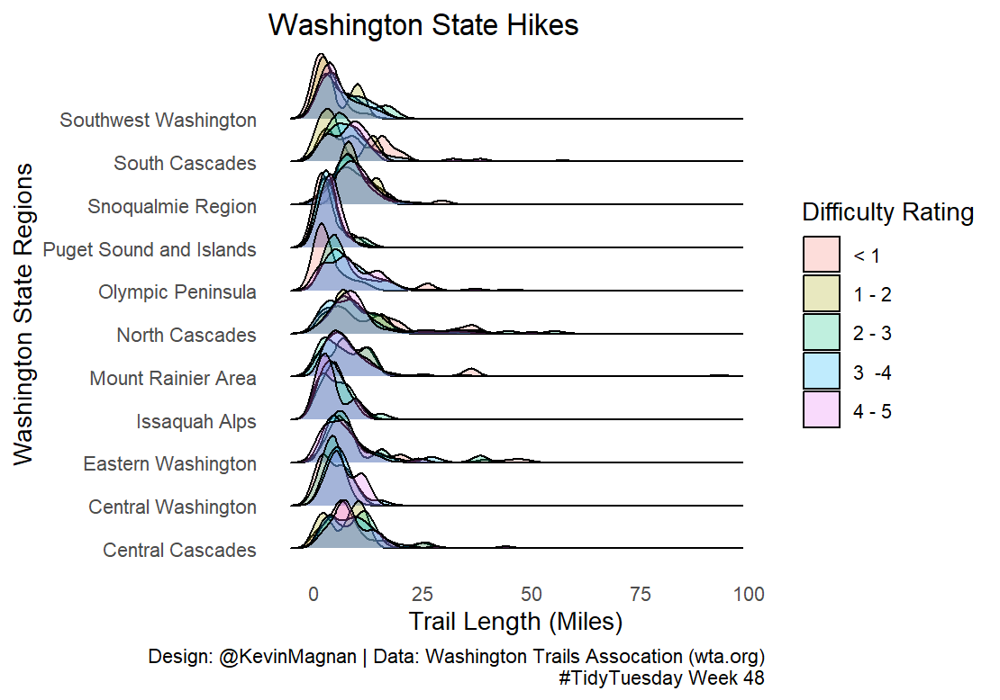

#TidyTuesday Exercises

Repository for .R and .Rmd files for my participation in the #TidyTuesday community weekly data project. Each week (when I have some free time!), I explore the #TidyTuesday dataset with a new R {package} to grow my R skills and learn new methods of data manipulation and visualization. 

| Date | Topic | Code | Viz|
| ------ | ------ | ------ | ------ |
| 11.03.2020 | IKEA Furniture | .[Rmd](Week_45/week_45.Rmd) | 
| 11.10.2020 | USA Phone Subscriptions | .[Rmd](Week_46/week_46.R) | 
| 11.24.2020 | Washington State Hikes | .[Rmd](Week_45/week_48.R) | 
